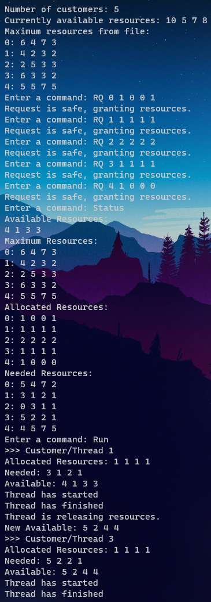
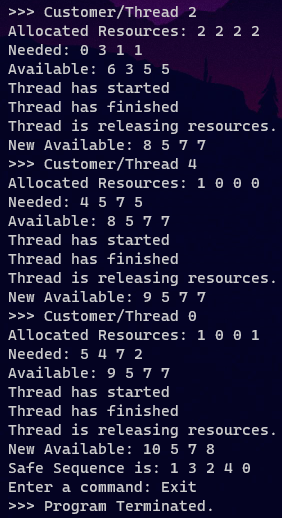
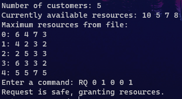
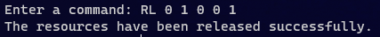
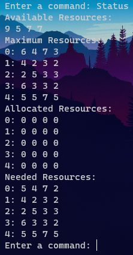
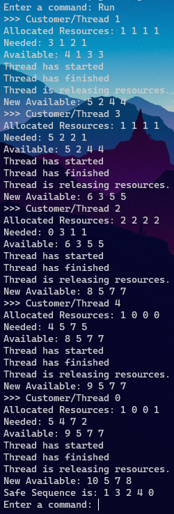

# Banker's Algorithm
Multithreaded code that implements the Banker's Algorithm. Customers request and release resources from the bank, and the banker keeps track of these resources. The banker will grant the request if it satisfies the safety algorithm.
## Motivation
Our motivation for implementing this project was to apply operating system concepts learned in class, to help us further understand the foundations that our computers are built upon.
Obtaining and building upon experience with operating systems other than Windows allows us to get an idea of what professionals in industry have at their disposal to develop cutting-edge software for all consumers.
## Installation
This program requires the following header files to run:
* stdio.h
* stdlib.h
* unistd.h
* string.h
* *pthread.h
* stdbool.h

_*pthread.h is a dynamically linked library, and MUST be linked at **compile time** with the flag "-pthread"_
## Screenshots
* Full Test Case (as defined on the assignment page)

 





* Request Resources


* Release Resources


* Resource Status


* Run Safety Algorithm


## Contributions
### Riley's Contribution
* Implemented main function
* Implemented read_file function
* Implemented customer_init function
* Implemented print_status function
* Implemented request_resources function
* Implemented run_safety_algorithm function
* Implemented command_handler function
### Torin's Contribution
* Implemented main function
* Implemented release_resources function
* Implemented request_resources_safety function
* Implemented release_resources_safety function
* Implemented thread_run function

## Features
* Available resources are inputted by the user via command line
* To change the number of resources you want the algorithm to handle (default is 4), **change NUM_RESOURCES on line 43**
* Handles manual resource request and release commands
    * Command structure follows the pattern of:
        * "RQ x x x ... x" -> where the number of x's is the number of resources
        * "RL x x x ... x" -> where the number of x's is the number of resources
* "Status" command displays maximum, allocated and needed resources for each customer as well as the resources available to all of them
* "Run" command runs the safe sequence algorithm with the system in its current state 

_**Note that all commands are **case sensitive** and any other input will produce "Command not recognized, please try again!"_
## Tests
### Resource Request Test

* The 0 immediately after the "RQ" is the customer (customer_id) making the request
* The 4 digits after the customer_id is the number of each resource being requested, seperated by spaces
### Resource Release Test

* The 0 immediately after the "RL" is the customer (customer_id) making the request
* The 4 digits after the customer_id is the number of each resource being requested, seperated by spaces
### Resource Status Test

* The command displays the resources available to all customers, and then the maximum, allocated, and needed resources for each customer
* Each customers maximum, allocated and needed resources is represented by a row that follows the format: "customer_id: x x x ... x
### Run Test

* The safety algorithm will run through each thread that can be allocated resources and display its allocated and needed resources, as well as the resources currently available
* Once every thread has been given the resources it needs, it will display the safe sequence of resource allocation
* It will otherwise say "No possible safe sequence!" if it cannot allocate resources to ALL customers
## Code Example
To compile and run type in the shell:
```
gcc BankersAlgorithm.c -o bankers -ggdb -lrt -pthread
./bankers x x x ... x
```

Valid commands:
```
RQ x x x ... x
RL x x x ... x
Status
Run
Exit
```

See Tests section for output behaviour and explanation
## Authors
Riley Adams - adam6070@mylaurier.ca

Torin Borton-McCallum - bort4620@mylaurier.ca

## Credits
Dr. Sukhjit Singh Sehra - Professor teaching Operating Systems (CP386)

Wilfrid Laurier University

## License
MIT License -> See the LICENSE file for details.
